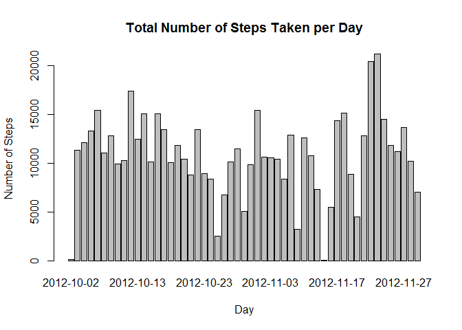
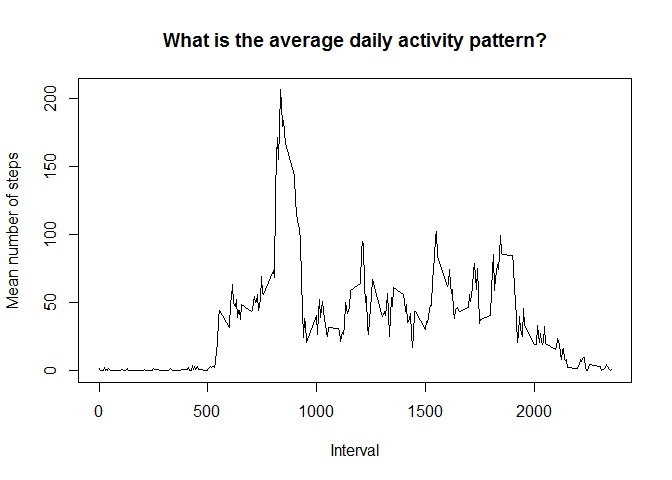
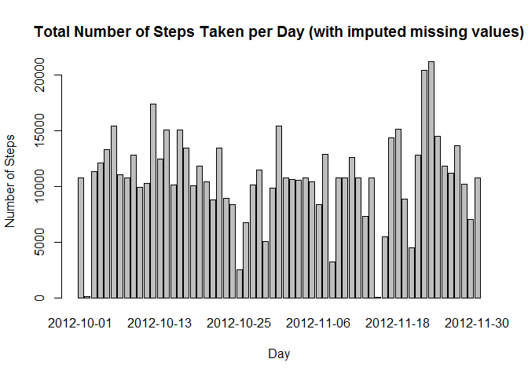
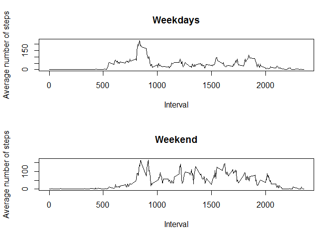

# Reproducable Research: Course Project 1
Sabine SH  
Monday, April 21, 2017  

This is an R Markdown document showing the use of data from a personal activity monitoring device. The work was done as part of course "Reproducable Research". 

### Loading and preprocessing the data
activity: original data
activity2: missing data ignored
activitySum: aggregation on year (summation)

```r
activity <- read.csv("activity.csv")
activity2 <- na.omit(activity)
activitySum <- aggregate(steps ~ date, activity2, sum)
```

### What is mean total number of steps taken per day?

Histogram on total number of steps taken per day:


```r
barplot(height=activitySum$steps, names.arg=activitySum$date, xlab="Day", ylab="Number of Steps", main="Total Number of Steps Taken per Day")
```

<!-- -->


Calculation of mean total number of steps taken per day

```r
mean(activitySum$steps)
```

```
## [1] 10766.19
```
Calculation of median total number of steps taken per day 

```r
median(activitySum$steps)
```

```
## [1] 10765
```

### What is the average daily activity pattern?

First of all, we have to aggregate the data for each interval 

```r
activityInterval <- aggregate(steps ~ interval, activity, mean)
```
Here is the time series plot 

```r
plot(activityInterval$interval, activityInterval$steps, type = "l",xlab="Interval", ylab="Mean number of steps", main="What is the average daily activity pattern?")
```

<!-- -->

Which 5-minute interval, on average across all the days in the dataset, contains the maximum number of steps?

```r
activityInterval$interval[which.max(activityInterval$steps)]
```

```
## [1] 835
```
### Imputing missing values

Calculate and report the total number of missing values in the dataset

```r
table(is.na(activity))
```

```
## 
## FALSE  TRUE 
## 50400  2304
```
As an approach, I will use the mean for each interval that was computed before and merge them with the original data

```r
activityM <- merge(activity, activityInterval, by = "interval")
activityM$CalcSteps <- ifelse(is.na(activityM$steps.x),
                        activityM$steps.y,
                        activityM$steps.x
                    )
```
Histogram of the total number of steps taken each day


```r
activitySumM <- aggregate(CalcSteps ~ date, activityM, sum)
barplot(height=activitySumM$CalcSteps, names.arg=activitySumM$date, xlab="Day", ylab="Number of Steps", main="Total Number of Steps Taken per Day (with imputed missing values)")
```

<!-- -->


Calculation of mean total number of steps taken per day

```r
mean(activitySumM$CalcSteps)
```

```
## [1] 10766.19
```
Calculation of median total number of steps taken per day 

```r
median(activitySumM$CalcSteps)
```

```
## [1] 10766.19
```

These values differ only slightly from the estimates from the first parts.

### Are there differences in activity patterns between weekdays and weekends?

Creation of a new vector variable "day" and "weekday"

```r
activityM$day <- weekdays(as.Date(activityM$date))
activityM$weekday <- ifelse(activityM$day %in% c("Sonntag","Samstag"),"weekend","weekday")
```

Creating a panel plot containing a time series plot of the 5-minute interval (x-axis) and the average number of steps taken

```r
activityWD <- subset(activityM,activityM$weekday == "weekday")
activityWE <- subset(activityM,activityM$weekday == "weekend")
activityIntWD <- aggregate(CalcSteps ~ interval, activityWD, mean)
activityIntWE <- aggregate(CalcSteps ~ interval, activityWE, mean)

par(mfrow=c(2,1))
plot(activityIntWD$interval, activityIntWD$CalcSteps, type = "l",xlab="Interval", ylab="Average number of steps", main="Weekdays")
plot(activityIntWE$interval, activityIntWE$CalcSteps, type = "l",xlab="Interval", ylab="Average number of steps", main="Weekend")
```

<!-- -->
